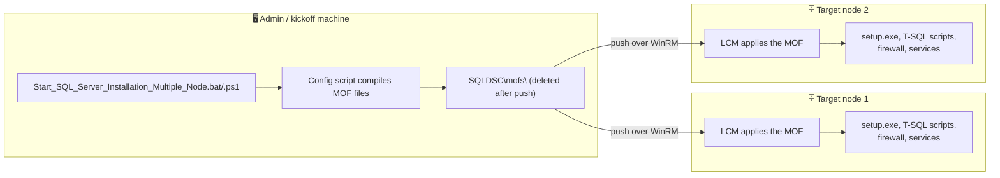
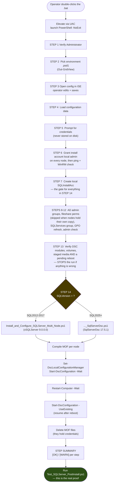
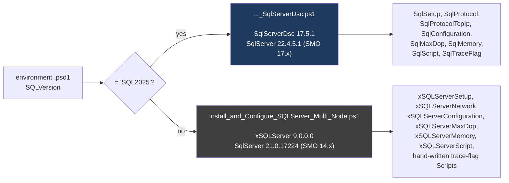
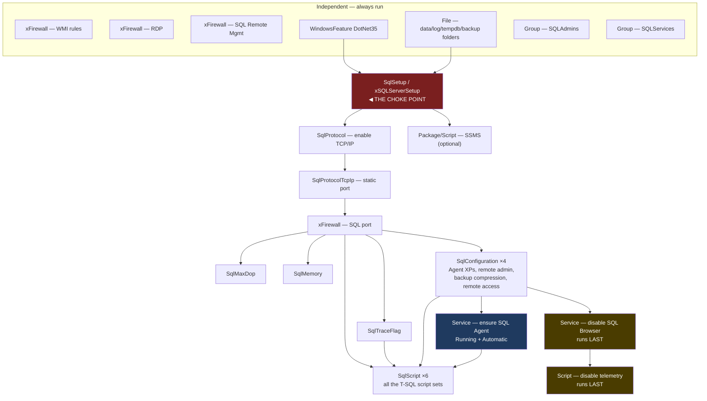
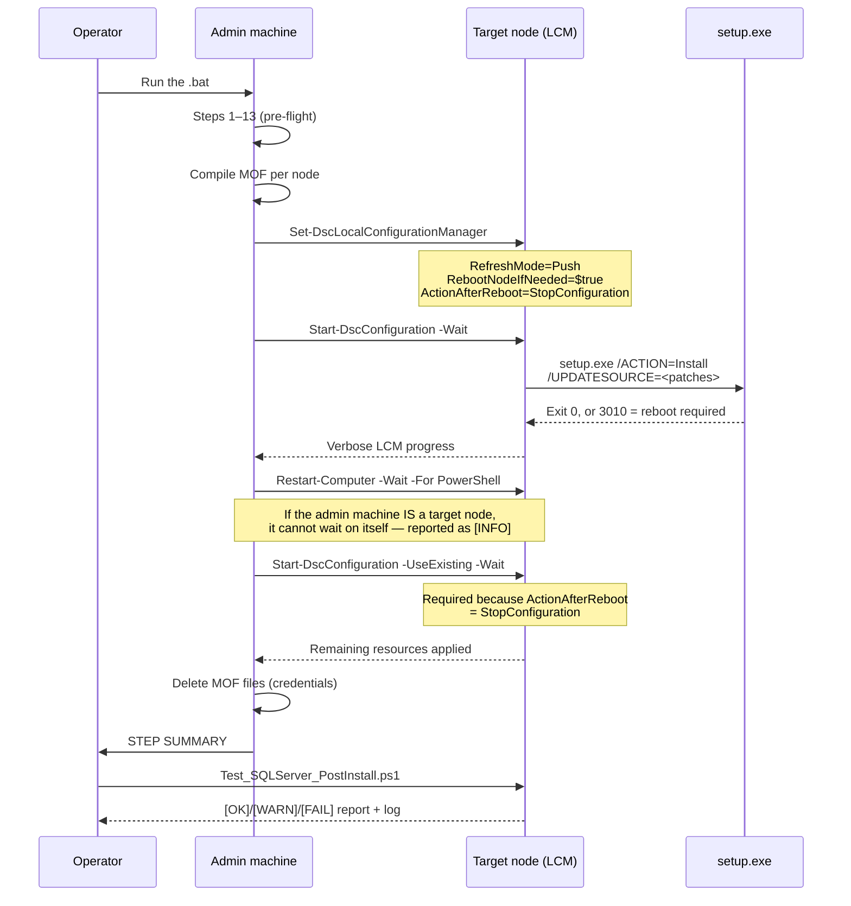
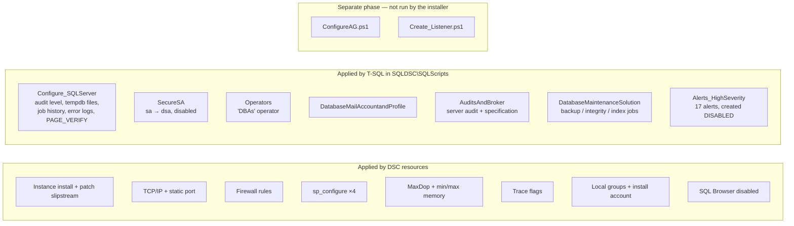
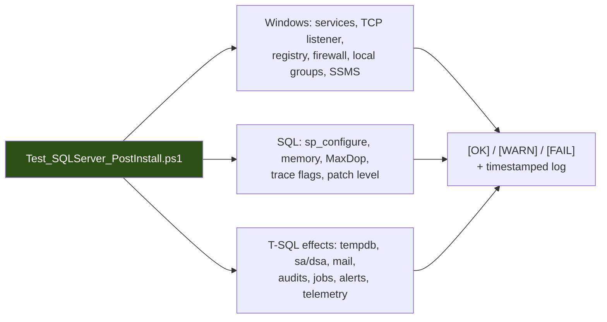

# SQL Server Installation — Process Flow

How this toolkit installs and configures SQL Server, end to end.

This document explains **what runs, in what order, on which machine, and what depends
on what**. Read it before changing the toolkit — most of the failures this toolkit has
hit were caused by dependency ordering rather than by any individual step being wrong.

For operating instructions see the [README](../README.md). This document is the
"how it works" companion.

---

## 1. The three machines

Almost every confusing failure in this toolkit traces back to *which machine* something
runs on. There are three roles:



| Runs on the **admin machine** | Runs on the **target nodes** |
|---|---|
| The `.bat` / kickoff `.ps1` (Steps 1–14) | Everything inside the DSC configuration |
| Reading the environment `.psd1` | `setup.exe` and patch slipstreaming |
| Enumerating `SQLDSC\SQLScripts\*Set.sql` | Executing those same T-SQL files |
| Compiling MOF files | Applying the MOF (the LCM) |
| Local group / remoting pre-checks | Firewall rules, services, registry |

**Practical consequences**

* A file the DSC configuration *references* must exist on the **nodes**, even though
  the script that names it runs on the **admin machine**. This is why the T-SQL scripts,
  the SQL media, and the patch folder all have to be staged on every node when
  `Copy_all_Files_to_TargetNodes = 'NO'`.
* `UpdateSource` is validated by `setup.exe` **on the node**, so it must be reachable
  from there — a UNC path to a share that doesn't exist fails the whole install.
* MOF files can contain credentials, so they are deleted from the admin machine
  immediately after the push.

---

## 2. End-to-end flow



> **The STEP SUMMARY is not proof of success.** It reports what the *installer script*
> did, not whether the desired state was reached. A run can print `DONE` while almost
> nothing was configured — see §4. The verification script is the check that matters.
>
> It is, however, no longer allowed to *contradict* itself: the step that stops a run is
> marked `[FAILED]`, and Step 7 verifies the account it created rather than assuming the
> remote call worked. Both used to print `[OK]` while having failed.

### Step 13 is the gate, and it checks four things

Everything here is a precondition — something that must already be true before a MOF is
pushed, and that the configuration cannot create for itself. Each entry earned its place by
costing a deployment.

| Check | What it caught |
|---|---|
| DSC modules present **and complete** | modules truncated to 2 of 197 files; every resource in them became `Undefined DSC resource` at deployment |
| Data volumes exist | the config creates folders, not disks |
| Staged folders present **and complete** | partial copies of the media and script folders that a `Test-Path` passed |
| No pending reboot | SQL setup refuses to install, fails its rules in 3 seconds with exit code 3010, and installs nothing |

The pending reboot is the sharpest of them. Without this check the run continued, `SqlSetup`
reported only that it could not reach the desired state, every dependent resource was
skipped, and the run still printed `DONE` — with nothing installed on the node at all.

### Step 14 recovers from a dropped session

SQL Server setup reboots the node, and `SqlProtocolTcpIp`, `SqlConfiguration` and
`SqlTraceFlag` each restart the SQL service. Any of those can take the WS-Management session
with it:

```
The WS-Management service cannot process the operation. The operation is being
attempted on a client session that is unusable.
```

Everything after that point used to be abandoned, leaving a node with SQL installed, the
port set, and no configuration — reported as a single warning.

The resume now runs in up to three passes. A pass that loses its session waits, confirms the
SQL service is back on every node, and retries. A pass that fails for any *other* reason
stops and reports, because retrying a genuine failure only hides it.

```
[INFO] Pass 1 lost its remote session -- almost always a SQL service restart taking WinRM with it.
  Applying configuration (pass 2 of up to 3) ...
  [OK] Configuration applied with no resource errors on pass 2.
```

### Two prerequisites the installer handles, and two it cannot

Step 6 makes the domain install account a local administrator on each node, because Step 6
itself then connects as that account. It uses the **operator's** rights to do so — an
account cannot grant rights to itself, so whoever runs the installer must already be a
local administrator on the target nodes. That, and the existence of the data volumes, are
the two things no script can create. Step 13 at least refuses to deploy without them.

---

## 3. Version selection

Two configuration scripts exist. The kickoff script chooses between them from
`NonNodeData.SQL.SQLVersion`; there is no manual selection.



**Why two scripts rather than one with branches.** `xSQLServer` 9.0.0.0 loads SMO/WMI
assemblies pinned to the SQL major version (`Version=<major>.0.0.0`). SQL2017 asks for
`14.0.0.0` and gets it; SQL2025 asks for `17.0.0.0`, which that module's dependencies
don't contain. The resource that configures TCP/IP and the static port depends on that
assembly, so on SQL2025 it cannot work. The defect is inside the module, so it can't be
worked around with an `if` — SQL2025 needs a different module, and swapping the module
inside a shared file would put the proven SQL2017 path at risk.

Separate files give a guarantee a shared file cannot: **a SQL2012–2017 run never opens
the newer script, never imports `SqlServerDsc`, and never loads SMO 17.x.**

---

## 4. DSC resource dependency graph ⚠️

**This is the most important diagram in this document.** DSC skips every resource whose
dependency failed. Because almost everything hangs off the setup resource, a single
failure there silently skips the entire configuration — while the run still reports
`DONE`.



> **The local install account is not in this graph.** A `User` resource used to create it
> here. It was removed: whenever a `Password` is supplied, that resource's `Test` validates
> it by attempting a logon, which a hardened server refuses regardless of whether the
> account exists — so it failed on every run and, through it, failed the whole
> configuration. **Step 7 of the kickoff script owns that account now**, which it has to,
> because Step 6 already needs it before any MOF is pushed.

### The cascade failure

If `SqlSetup` reports failure, **everything below it is skipped**: TCP/IP, the static
port, the firewall rule, SSMS, all four `sp_configure` options, MaxDop, memory, trace
flags and every T-SQL script. SQL Server itself still installs correctly —
`setup.exe` reports `Passed` — but the instance ends up almost entirely unconfigured.

**The tell:**
```
Test-TargetResource returned false after calling Set-TargetResource
```
This means the install ran but the resource cannot *detect* the result afterwards.

**Diagnosing it:** compare the `FEATURES:` line and `Product features discovered:`
in the node's `Summary.txt` against the feature list in `$sqlVersionInfo`. Anything
requested but never installed makes the check unsatisfiable forever. This is exactly
what happened with SQL2025 and `CONN,BC` — that version's `setup.exe` silently ignores
them, so the resource looked for features that were never going to appear.

**Its signature in a verification report:** everything with no dependency passes, while
everything downstream of setup is missing.

### Two deliberate "runs last" resources

| Resource | Why it must be last |
|---|---|
| **Disable SQL Browser** | With a non-default port, named-instance resolution (`<node>\<instance>`) depends on SQL Browser (UDP 1434). Several resources — including the setup resource's own state check — connect that way. Disabling Browser early makes them fail with `Failed to connect to SQL instance`, triggering the cascade above. |
| **Disable telemetry** | Several earlier resources restart the Database Engine (the `remote access` option and trace flags both require it), and a restart brings the telemetry services back up. Disabling them earlier gets silently undone. |

### One resource that must run BEFORE the T-SQL scripts

`Service — ensure SQL Agent Running` exists because of a fresh-install-only trap.

Two scripts call `msdb.dbo.sp_set_sqlagent_properties`, which SQL refuses unless
`Agent XPs` is enabled. That option is **not stable**: SQL turns it on when the Agent
service starts and off when it stops. So setting the `sp_configure` option is not enough —
anything that restarts the engine leaves it reading `0` until Agent is back up, and both
the `remote access` option and `SqlTraceFlag` restart the engine.

On a fresh install the trace flags genuinely change, so the restart really happens, and the
scripts ran inside the window:

```
19:17:03  SQL Server Agent (CAPPT) entered the stopped state
19:19:35  SQL Server Agent (CAPPT) entered the running state
```

An existing node never reproduces this, because the flags already match and the resource
skips. The scripts therefore **also enable `Agent XPs` for themselves** — the dependency
ordering only avoids restarting mid-script; the guard inside the scripts is the actual fix.

This resource earns its place for a second reason: nothing else managed that service, and a
fresh install commonly leaves Agent on **Manual** — in which case the nine maintenance jobs
never run, and nothing reports it, because the jobs exist and are enabled.

---

## 5. Deployment sequence, including the reboot



---

## 6. What actually gets configured

Grouped by the mechanism that applies it — useful when a verification `[WARN]` needs
tracing back to a source.



Each T-SQL set is a trio: `*_Set.sql` does the work, `*_Test.sql` is the idempotency
check, `*_Get.sql` is for reporting. Most `_Test.sql` files in this repo are stubs, so
the `_Set.sql` scripts carry their own `IF NOT EXISTS` guards — they are safe to re-run.

---

## 7. Where failures actually come from

Ranked by how often they have bitten this toolkit:

| # | Failure | Symptom | Fix |
|---|---|---|---|
| 1 | Setup resource can't verify itself | Everything downstream silently skipped, run still says `DONE` | Match `$sqlVersionInfo` features to what `setup.exe` really installs (§4) |
| 2 | Running from a UNC path | `File ... is not digitally signed` | Run from a genuinely local path (`C:\SQLInstall`) |
| 3 | `UpdateSource` unreachable from the node | `InvalidUpdateSourcePath`, install aborts in seconds | Use a local path when bits are staged locally |
| 4 | Stale copy on the admin machine | Run behaves like an older version of the toolkit | Re-copy changed files; confirm the "Using DSC configuration:" line |
| 5 | Unresolvable AD principal | Whole `Group` resource fails, group never created | One bad name fails all members — verify every entry |
| 6 | SQL Browser disabled too early | `Failed to connect to SQL instance <node>\<instance>` | Keep Browser up until configuration completes |
| 7 | Module/SQL version mismatch | Protocol/port never configured | Use the module built for that SQL release (§3) |

---

## 8. Verifying the result

The installer reports what it *attempted*. `Test_SQLServer_PostInstall.ps1` reports what
is *true*, by reading the live instance and the node's actual state.



It reads the same environment `.psd1` as the installer, so "desired" always means what
that deployment actually asked for. SQL connections are made **locally on each node**
(`localhost,<port>`), because the SQL port is frequently unreachable across the network
in hardened environments, and because modern clients reject SQL Server's self-signed
certificate by default.

---

## 9. Quick reference

```
Admin machine                          Target nodes
─────────────                          ────────────
Kickoff .bat/.ps1  ─── Steps 1-13 ───▶ local groups, GPO, remoting
                   ─── Step 14 ──────▶ MOF push
                                       ├── setup.exe + patches
                                       ├── TCP/IP + port + firewall
                                       ├── sp_configure / memory / trace flags
                                       ├── T-SQL script sets
                                       └── Browser + telemetry disabled (last)

Then, on each node:  Test_SQLServer_PostInstall.ps1   ◀── the actual proof
```

**Related documents**

* [README](../README.md) — operating instructions, prerequisites, troubleshooting
* [SQLDSC/modules/README.md](../SQLDSC/modules/README.md) — module layout and versions
